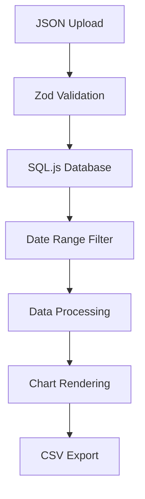

# LiveGraphs Static - Code Documentation

## Overview

LiveGraphs Static is a Next.js-based web application for visualizing chatbot conversation analytics. It processes JSON data files containing chatbot session logs and generates interactive visualizations using Chart.js and Nivo charts. The application runs entirely in the browser using SQL.js for data storage.

## Architecture

### Core Components

```plaintext
├── app/
│   ├── page.tsx              # Main application entry point
│   ├── layout.tsx            # Root layout with providers
│   └── globals.css           # Global styles
├── components/
│   ├── charts/               # Chart visualization components
│   ├── ui/                   # Reusable UI components
│   └── Logo.tsx              # Application logo
├── lib/
│   ├── db/                   # Database layer (SQL.js)
│   ├── validation/           # Data validation schemas
│   ├── types/                # TypeScript definitions
│   ├── dataProcessor.ts      # Data processing logic
│   └── utils.ts              # Utility functions
└── hooks/                    # Custom React hooks
```

### Data Flow



## Core APIs

### Database Layer (`lib/db/database.ts`)

#### `useDatabase` Hook

```typescript
interface DatabaseState {
  db: Database | null;
  isLoading: boolean;
  isInitialized: boolean;
}

function useDatabase(): DatabaseState & {
  initializeDatabase: () => Promise<void>;
  saveDatabase: () => void;
  clearDatabase: () => void;
  insertSessions: (sessions: ChatSession[]) => Promise<void>;
  getSessions: (startDate?: string, endDate?: string) => Promise<ChatSession[]>;
}
```

**Key Methods:**

- `initializeDatabase()`: Initializes SQL.js with WebAssembly
- `insertSessions(sessions)`: Bulk insert with transaction support
- `getSessions(startDate, endDate)`: Query sessions with date filtering
- `saveDatabase()`: Persist to localStorage
- `clearDatabase()`: Reset database state

### Data Processing (`lib/dataProcessor.ts`)

#### Core Functions

```typescript
// Calculate high-level KPIs
function calculateMetrics(sessions: ChatSession[]): Metrics

// Transform data for chart visualization
function prepareChartData(sessions: ChatSession[]): ChartData

// Generate CSV export
function exportToCSV(sessions: ChatSession[], filename: string): void
```

#### Metrics Interface

```typescript
interface Metrics {
  totalSessions: number;
  avgResponseTime: number;
  totalCost: number;
  avgRating: number;
  escalationRate: number;
  resolutionRate: number;
  topCategories: Array<{category: string, count: number}>;
  sentimentDistribution: Record<string, number>;
  // ... additional metrics
}
```

### Validation Layer (`lib/validation/schema.ts`)

#### Session Schema

```typescript
const ChatSessionSchema = z.object({
  session_id: z.string().uuid(),
  start_time: z.string().datetime(),
  end_time: z.string().datetime(),
  transcript: z.array(TranscriptMessageSchema),
  messages: MessageMetricsSchema,
  user: UserInfoSchema,
  sentiment: z.enum(['positive', 'neutral', 'negative']),
  escalated: z.boolean(),
  forwarded_hr: z.boolean(),
  category: z.string(),
  questions: z.array(z.string()),
  summary: z.string(),
  user_rating: z.number().min(1).max(5).optional()
});
```

**Privacy Features:**

- Automatic IP address anonymization
- PII data scrubbing during validation

## Chart Components

### Base Chart Structure

All chart components follow this pattern:

```typescript
interface ChartProps {
  data: ChartData;
  options?: ChartOptions;
  height?: number;
  className?: string;
}

const ChartComponent = React.memo(({data, options, ...props}: ChartProps) => {
  // Chart implementation
});
```

### Chart Types

#### 1. Analytics Chart (`AnalyticsChart.tsx`)

- **Purpose**: General metrics visualization
- **Types**: Bar, doughnut charts
- **API**: `<AnalyticsChart data={chartData.analytics} type="bar" />`

#### 2. Performance Trends (`PerformanceTrendsChart.tsx`)

- **Purpose**: Time-series performance metrics
- **Library**: Chart.js line charts
- **API**: `<PerformanceTrendsChart data={chartData.performance} />`

#### 3. Interactive Heatmap (`InteractiveHeatmap.tsx`)

- **Purpose**: Hourly usage patterns
- **Library**: Nivo heatmap
- **API**: `<InteractiveHeatmap data={chartData.heatmap} />`

#### 4. Bubble Chart (`BubbleChart.tsx`)

- **Purpose**: Cost vs session correlation
- **Library**: Chart.js bubble chart
- **API**: `<BubbleChart data={chartData.bubble} />`

#### 5. Gauge Chart (`GaugeChart.tsx`)

- **Purpose**: Average rating display
- **Library**: react-gauge-component
- **API**: `<GaugeChart rating={metrics.avgRating} />`

### Chart Configuration

Charts support consistent theming and accessibility:

```typescript
interface ChartOptions {
  responsive: boolean;
  maintainAspectRatio: boolean;
  plugins: {
    legend: LegendConfiguration;
    tooltip: TooltipConfiguration;
  };
  accessibility: {
    enabled: boolean;
    announceNewData: boolean;
  };
}
```

## State Management

### Main Application State (`app/page.tsx`)

```typescript
interface AppState {
  // Database state
  sessions: ChatSession[];
  filteredSessions: ChatSession[];
  
  // UI state
  isLoading: boolean;
  error: string | null;
  dateRange: [Date, Date];
  
  // Chart state
  metrics: Metrics;
  chartData: ChartData;
  expandedSections: Set<string>;
}
```

### Data Management Hook (`hooks/useDataManagement.ts`)

```typescript
interface DataManagement {
  // Data operations
  loadData: (file: File) => Promise<void>;
  filterByDateRange: (start: Date, end: Date) => void;
  exportData: () => void;
  clearData: () => void;
  
  // State
  isProcessing: boolean;
  error: string | null;
}
```

## Testing Patterns

### Component Testing

```typescript
// Chart component test pattern
describe('AnalyticsChart', () => {
  const mockData = generateMockChartData();
  
  it('renders chart with data', () => {
    render(<AnalyticsChart data={mockData} />);
    expect(screen.getByRole('img')).toBeInTheDocument();
  });
  
  it('handles empty data gracefully', () => {
    render(<AnalyticsChart data={{}} />);
    expect(screen.getByText('No data available')).toBeInTheDocument();
  });
});
```

### Database Testing

```typescript
// Database operation testing
describe('Database Operations', () => {
  let db: Database;
  
  beforeEach(async () => {
    db = await initializeDatabase();
  });
  
  it('inserts and queries sessions', async () => {
    const sessions = generateMockSessions(10);
    await insertSessions(db, sessions);
    
    const retrieved = await getSessions(db);
    expect(retrieved).toHaveLength(10);
  });
});
```

## Performance Optimizations

### React Optimizations

```typescript
// Memoized chart components
const AnalyticsChart = React.memo(({data, options}) => {
  const chartRef = useRef<Chart>(null);
  
  // Prevent unnecessary re-renders
  const memoizedOptions = useMemo(() => ({
    ...defaultOptions,
    ...options
  }), [options]);
  
  return <Chart ref={chartRef} data={data} options={memoizedOptions} />;
});
```

### Database Optimizations

```sql
-- Optimized queries with indexes
CREATE INDEX idx_sessions_date ON sessions(start_time);
CREATE INDEX idx_sessions_category ON sessions(category);
CREATE INDEX idx_messages_session ON messages(session_id);

-- Aggregated views for performance
CREATE VIEW daily_stats AS
SELECT 
  DATE(start_time) as date,
  COUNT(*) as session_count,
  AVG(messages.response_time) as avg_response_time
FROM sessions 
JOIN messages ON sessions.session_id = messages.session_id
GROUP BY DATE(start_time);
```

## Error Handling

### Validation Errors

```typescript
try {
  const validatedData = ChatSessionSchema.parse(jsonData);
  await insertSessions(validatedData);
} catch (error) {
  if (error instanceof z.ZodError) {
    setError(`Data validation failed: ${error.message}`);
  } else {
    setError(`Processing failed: ${error.message}`);
  }
}
```

### Chart Error Boundaries

```typescript
class ChartErrorBoundary extends React.Component {
  static getDerivedStateFromError(error: Error) {
    return { hasError: true, error };
  }
  
  render() {
    if (this.state.hasError) {
      return <ChartErrorFallback error={this.state.error} />;
    }
    return this.props.children;
  }
}
```

## Security Considerations

### Data Privacy

1. **IP Address Anonymization**: Automatic during validation
2. **Client-side Processing**: No data sent to external servers
3. **Local Storage**: Data persisted only in browser
4. **No External APIs**: Completely offline-capable

### Input Validation

```typescript
// Sanitize user inputs
const sanitizeInput = (input: string): string => {
  return input.replace(/<script[^>]*>.*?<\/script>/gi, '');
};

// Validate file types
const isValidJsonFile = (file: File): boolean => {
  return file.type === 'application/json' && file.size < MAX_FILE_SIZE;
};
```

## Build and Deployment

### Static Export Configuration

```typescript
// next.config.js
const nextConfig = {
  output: 'export',
  trailingSlash: true,
  images: {
    unoptimized: true
  },
  assetPrefix: process.env.NODE_ENV === 'production' ? '/livegraphs-static' : ''
};
```

### Docker Configuration

```dockerfile
# Multi-stage build
FROM node:24-alpine AS builder
WORKDIR /app
COPY package*.json ./
RUN npm install
COPY . .
RUN npm run build

FROM nginx:alpine
COPY --from=builder /app/out /usr/share/nginx/html
COPY nginx.conf /etc/nginx/nginx.conf
```

## Development Guidelines

### Code Conventions

1. **Components**: PascalCase, one per file
2. **Hooks**: camelCase starting with `use`
3. **Types**: PascalCase interfaces/types
4. **Constants**: UPPER_SNAKE_CASE
5. **Files**: kebab-case for multi-word names

### Testing Standards

- Minimum 80% code coverage
- Component tests for all UI components
- Integration tests for data flow
- E2E tests for critical user journeys

### Performance Standards

- Lighthouse score > 90
- First Contentful Paint < 2s
- Bundle size < 1MB gzipped
- Memory usage < 100MB for 10k records
